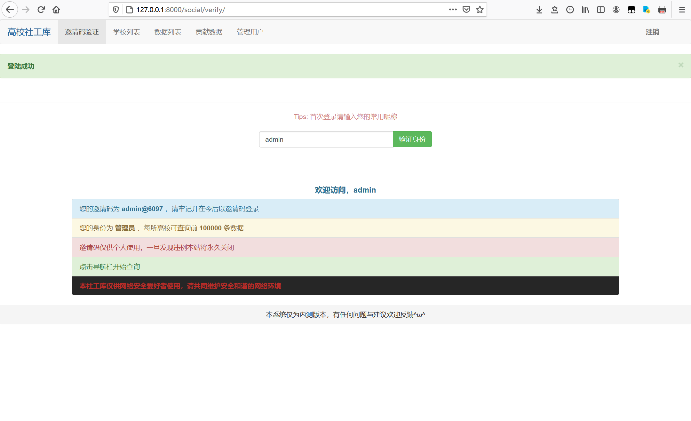
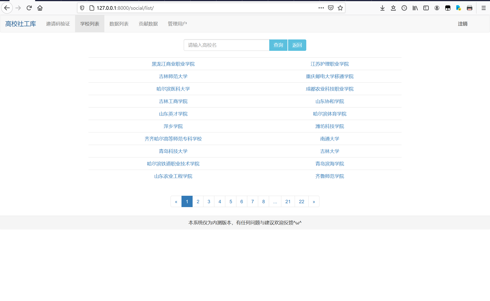
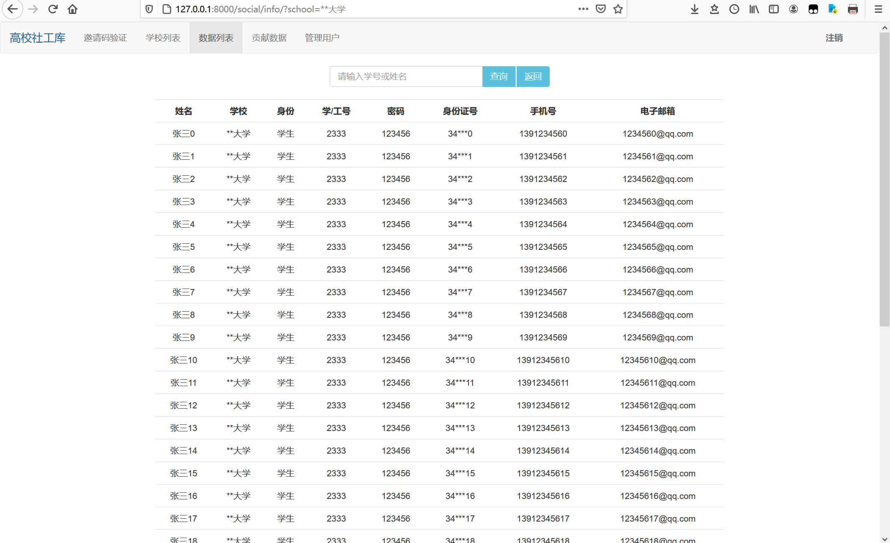
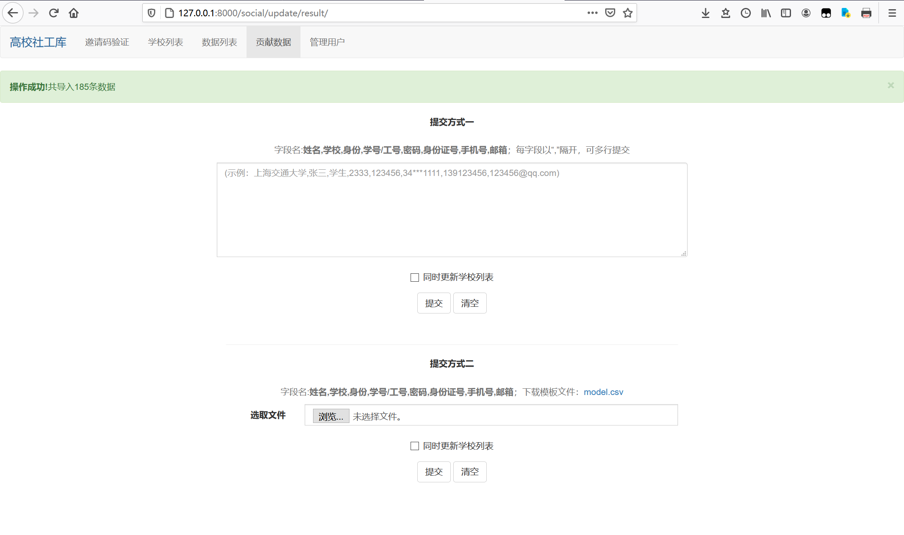
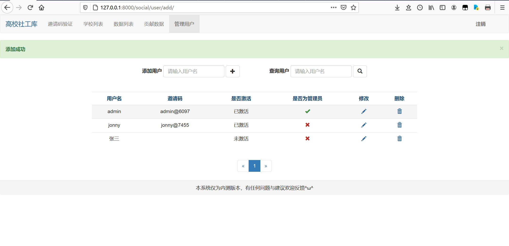

# socialDatabase
一个简易的社工库系统，目前仅针对edusrc下域名

**基于Django+bootstrap**

* 提供邀请码功能：

>权限暂时分为管理员与普通用户，管理员可使用用户名登陆，普通用户首次登陆后需使用分配的邀请码登录

* 主界面为学校列表：

* 点击学校进入用户信息列表：

>默认设置普通用户权限仅能查询前30条数据，可自己调整

* 可通过文本或文件方式上传数据：

* 用户信息管理：

* 后续会添加其他社工库支持
